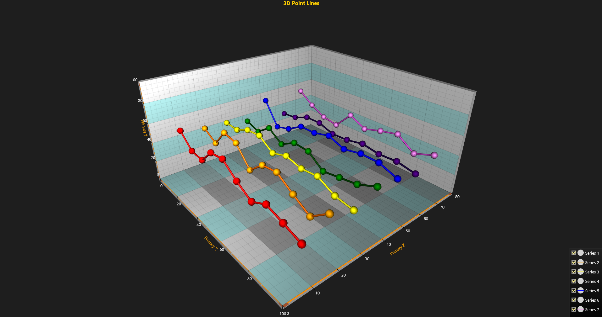

# Simple 3D Chart with Mouse Point Tracking and Annotations

This tutorial explains how to present points and lines in 3D charts using *PointLineSeries3D*, how to create multiple point series and track point values with the mouse. The tracked values are displayed using annotations, which allow displaying labels or graphics anywhere in the chart area.



##### 1. Define View3D as active view and define Z-axis range.
```csharp
// Set View3D as active view and set Z-axis range.
chart.ActiveView = ActiveView.View3D;
chart.View3D.ZAxisPrimary3D.SetRange(0, 80);
```

##### 2. Create a new PointLineSeries3D object for displaying the data.
```csharp
// Create a new PointLineSeries3D for displaying data and set axis bindings to primary axes.
var series = new PointLineSeries3D(chart.View3D, Axis3DBinding.Primary, Axis3DBinding.Primary, Axis3DBinding.Primary)
{
    // Set this to true to set a color for individual points.
    IndividualPointColors = true, 
    // Set this to true in order for mouse tracking to work.
    MouseInteraction = true 
};
```

##### 3. Apply styling to the newly created series.
```csharp
// Set a title to the series.
series.Title.Text = "Series 0";

// Set point shape to a sphere.
series.PointStyle.Shape3D = PointShape3D.Sphere;

// Set individual point size.
series.PointStyle.Size3D.SetValues(3, 3, 3);

// Set the width of the line between points.
series.LineStyle.Width = 0.4f;

// Draw the line between points with the same color as the points.
series.LineStyle.LineOptimization = LineOptimization.NormalWithShading; 

// Set a color to the line.
series.LineStyle.Color = Color.FromArgb(255, 255, 0, 0);
```

##### 4. Create a SeriesPoint3D array for data points and add data.
```csharp
// Create a SeriesPoint3D array for data points.
SeriesPoint3D[] points = new SeriesPoint3D[10];

// Generate sample data to the array.
for (int j = 0; j < 10; j++)
{
    // Random values for data points.
    points[j].X = 5 + j * 10;
    points[j].Y = 30 + random.NextDouble() * 25.0;
    points[j].Z = 10 + i * 10;

    // You can set an individual color to each point with the Color property.
    points[j].Color = Color.FromArgb(255, 255, 0, 0);
}

// Set the points array to series Points property.
series.Points = points;

// Add the series to chart's View3D.
chart.View3D.PointLineSeries3D.Add(series);
```

##### 5. Create an Annotation to display mouse tracking values
```csharp
// Create a new annotation to display target values when hovering over a point with the mouse.
mouseAnnotation = new Annotation3D(chart.View3D, Axis3DBinding.Primary, Axis3DBinding.Primary, Axis3DBinding.Primary)
{
    // Set the annotation as invisible by default.
    Visible = false,

    // Set the annotations target location coordinates to use axis values.
    TargetCoordinateSystem = AnnotationTargetCoordinates.AxisValues,
    
    // Set the annotations location to use relative screen coordinates to target.
    LocationCoordinateSystem = CoordinateSystem.RelativeCoordinatesToTarget,
    
    // Disable mouse interaction with the annotation.
    MouseInteraction = false
};

// Set offset to annotation.
mouseAnnotation.LocationRelativeOffset.SetValues(40, -70);

// Add annotation to View3D.
chart.View3D.Annotations.Add(mouseAnnotation);
```

##### 6. Add a MouseMove event handler to the chart for enabling point tracking
```csharp
chart.MouseMove += Chart_MouseMove;
```

##### 7. Create a function for mouse move event handler
```csharp
private void Chart_MouseMove(object sender, System.Windows.Input.MouseEventArgs e)
{
    // Call BeginUpdate for chart to disable rendering while mouse is moving 
    // over the chart to improve performance.
    chart.BeginUpdate();

    // Set label visible when not hovered over by mouse.
    mouseAnnotation.Visible = false;

    // Check if any object has been found under the mouse.
    object obj = chart.GetActiveMouseOverObject();
    if (obj != null)
    {
        // Check if the active mouse over object is a PointLineSeries object.
        if (obj is PointLineSeries3D)
        {
            PointLineSeries3D pointLineSeries3D = obj as PointLineSeries3D;

            // Get the point last hit by mouse.
            int pointIndex = pointLineSeries3D.LastMouseHitTestIndex;
            SeriesPoint3D point = pointLineSeries3D.Points[pointIndex];

            // Set annotation position to the moused over point.
            mouseAnnotation.TargetAxisValues.SetValues(point.X, point.Y, point.Z);

            // Set annotation text to display information about the moused over point.
            mouseAnnotation.Text = "Series index: " + chart.View3D.PointLineSeries3D.IndexOf(pointLineSeries3D).ToString()
                + "\nPoint index: " + pointIndex.ToString()
                + "\nX=" + point.X.ToString("0.0") + " ; Y=" + point.Y.ToString("0.0") + " ; Z=" + point.Z.ToString("0.0");

            // Set the annotation visible while mouse is hovering over the point.
            mouseAnnotation.Visible = true;
        }
    }

    // Call EndUpdate to enable rendering again after handling mouse move event.
    chart.EndUpdate();
}
```
